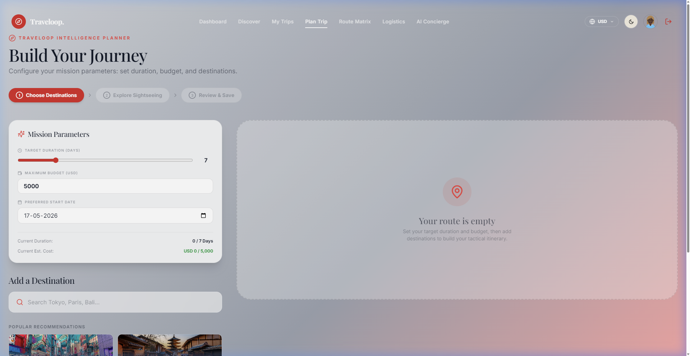
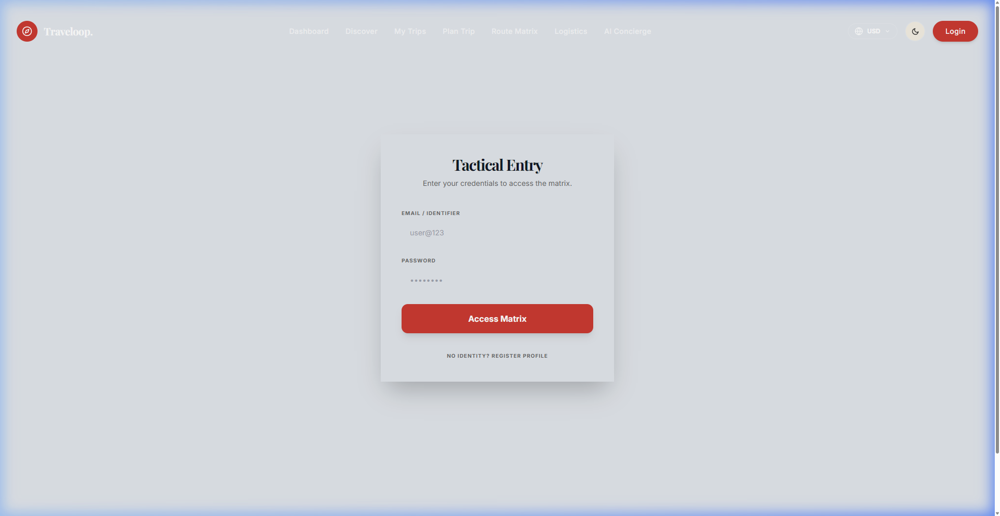

# Traveloop. 🧭
### *Luxury AI Travel Intelligence Matrix*

Traveloop is a premium, high-fidelity travel management platform designed for the modern explorer. It combines tactical planning intelligence with a curated global destination catalog to provide a seamless, luxury travel experience.


---

## 🌟 Key Features

### 🧩 Tactical Itinerary Matrix
Our core planning engine allows you to build complex multi-city journeys with surgical precision. 
- **Dynamic Duration Control**: Set a target trip length and let the AI distribute your mission window across destinations.
- **Fiscal Burn Tracking**: Define a maximum budget and monitor utilization in real-time as you add famous places and activities.
- **Drag-and-Drop Logistics**: Effortlessly reorder your route with automatic date and schedule recalculation.



### 📊 Intelligence Command Center
A centralized dashboard providing deep telemetry on your past, current, and future deployments.
- **Mission Metrics**: Track total journeys, worldwide coverage, and fiscal efficiency.
- **Discovery Engine**: AI-suggested destinations based on seasonal intelligence and regional interests.

### 🌎 Global Intelligence Database
An expansive catalog of over 30+ world-class destinations, each enriched with:
- **Sightseeing Reconnaissance**: Detailed reports on landmarks, nature, food, and culture.
- **Climate Data**: Real-time weather intelligence for perfect mission timing.
- **Fiscal Estimates**: Daily cost projections to keep your operations within budget limits.

### 🔐 Secure Matrix Access
- **JWT-Based Identity Verification**: Professional-grade security for your travel data.
- **Zero-Data Resilience**: Robust local fallback systems ensure your data is accessible even during backend maintenance.

---

## 🛠️ Technical Architecture

### Frontend (Intelligence Layer)
- **Framework**: Next.js 14 (App Router)
- **Logic**: Zustand (State Management), React Context
- **Animation**: Framer Motion (Luxury Transitions)
- **Styling**: Tailwind CSS (Dark/Cream Luxury Palette)
- **Icons**: Lucide React

### Backend (Data Core)
- **Runtime**: Node.js / Express
- **ORM**: Prisma
- **Database**: PostgreSQL
- **Security**: JWT Authentication, Bcrypt Password Hashing

---

## 🚀 Deployment & Installation

### Prerequisite Matrix
- Node.js (v18+)
- PostgreSQL Instance

### Intelligence Layer Setup (Frontend)
```bash
cd TRAVELOOP/client
npm install
npm run dev
```

### Data Core Setup (Backend)
```bash
cd TRAVELOOP/server
npm install
# Configure .env with DATABASE_URL
npx prisma db push
npm run dev
```

---

## 🔑 Demo Access
For the hackathon evaluation, use the **Tactical Mock Identity**:
- **Identifier**: `user@123`
- **Access Code**: `PASS@123`

---

### 🎨 Design Aesthetic: *Luxury Intelligence*
The platform adheres to a strict "Luxury Intelligence" design system, utilizing a **Black & Cream** high-contrast palette, **Serif** typography for high-end readability, and **Glassmorphism** for depth.



---

Developed for the **ODDO HACKATHON**.  
*Traveloop: Tactical Intelligence for the Modern Explorer.*
